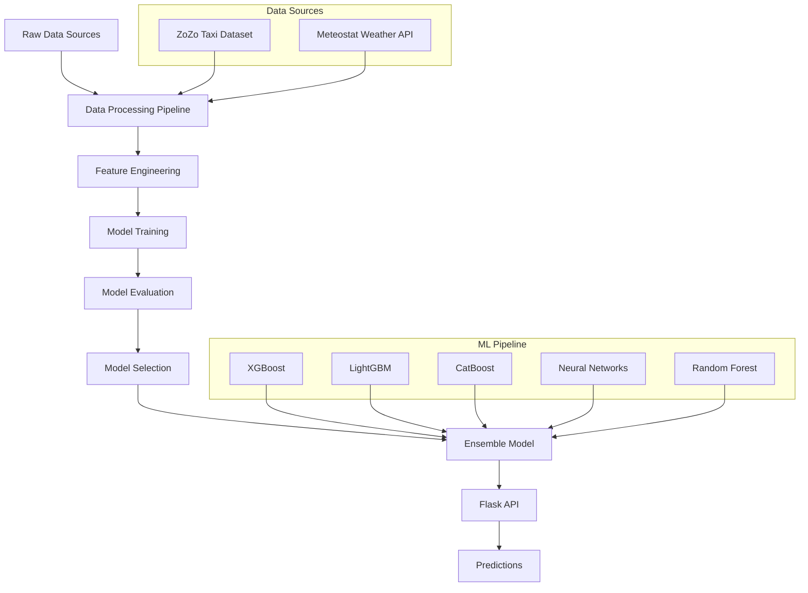
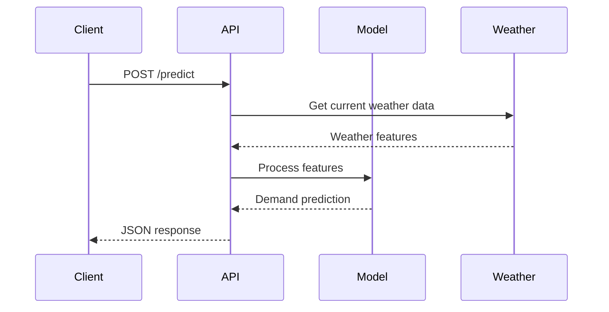

# 🚖 Taxi Demand Forecasting System

A machine learning-powered system that predicts taxi demand using historical ride data and weather information. This project combines advanced ML algorithms with real-time weather data to provide accurate demand forecasting for taxi services.

## 📋 Table of Contents

- [Overview](#overview)
- [Features](#features)
- [System Architecture](#system-architecture)
- [Data Sources](#data-sources)
- [Installation](#installation)
- [Usage](#usage)
- [API Documentation](#api-documentation)
- [Model Performance](#model-performance)
- [Project Structure](#project-structure)
- [Development Workflow](#development-workflow)
- [Contributing](#contributing)
- [License](#license)

## 🎯 Overview

This system predicts taxi demand by analyzing historical patterns, weather conditions, and temporal features. It uses ensemble machine learning models to provide accurate forecasting that can help taxi companies optimize their fleet distribution and improve service efficiency.

### Key Capabilities
- **Real-time Predictions**: Get instant demand forecasts via REST API
- **Weather Integration**: Incorporates weather data for improved accuracy
- **Multiple ML Models**: Ensemble approach using XGBoost, LightGBM, CatBoost, and Neural Networks
- **Scalable Architecture**: Built with Flask for easy deployment and scaling

## ✨ Features

- 🔮 **Demand Forecasting**: Predict taxi demand for specific locations and times
- 🌤️ **Weather Integration**: Real-time weather data integration using Meteostat
- 📊 **Multiple Algorithms**: Comparison and ensemble of various ML algorithms
- 🚀 **REST API**: Easy-to-use API for integration with existing systems
- 📈 **Performance Analytics**: Comprehensive model evaluation and comparison
- 🔄 **Data Pipeline**: Automated data processing and feature engineering

## 🏗️ System Architecture



### System Flow Diagram



## 📊 Data Sources

### Primary Dataset
- **Source**: ZoZo Taxi Dataset
- **Period**: 5 months of historical data
- **Features**: Pickup/dropoff locations, timestamps, trip duration, fare information
- **Size**: Comprehensive ride data covering various temporal patterns

### Weather Data
- **Source**: Meteostat API
- **Features**: Temperature, humidity, precipitation, wind speed, weather conditions
- **Integration**: Real-time weather data fetching for enhanced predictions
- **Coverage**: Historical weather data aligned with taxi ride timestamps

## 🚀 Installation

### Prerequisites
- Python 3.13.7
- pip package manager
- Git

### Step 1: Clone the Repository
```bash
git clone <repository-url>
cd taxi-demand-forecasting
```

### Step 2: Create Virtual Environment
```bash
python -m venv venv

# On Windows
venv\Scripts\activate

# On macOS/Linux
source venv/bin/activate
```

### Step 3: Install Dependencies
```bash
pip install -r requirements.txt
```

### Step 4: Verify Model File
Ensure the trained model file `taxi_demand_model.pkl` is present in the root directory.

## 💻 Usage

### Starting the API Server

#### Development Mode
```bash
python app.py
```

#### Production Mode
```bash
gunicorn -w 4 -b 0.0.0.0:8000 app:app
```

The API will be available at `http://localhost:5000` (development) or `http://localhost:8000` (production).

### Making Predictions

#### Using curl
```bash
curl -X POST http://localhost:5000/predict \
  -H "Content-Type: application/json" \
  -d '{
    "features": {
      "hour": 14,
      "day_of_week": 1,
      "month": 6,
      "temperature": 25.5,
      "humidity": 65,
      "precipitation": 0,
      "wind_speed": 10.2,
      "pickup_latitude": 40.7589,
      "pickup_longitude": -73.9851
    }
  }'
```

#### Using Python
```python
import requests
import json

url = "http://localhost:5000/predict"
data = {
    "features": {
        "hour": 14,
        "day_of_week": 1,
        "month": 6,
        "temperature": 25.5,
        "humidity": 65,
        "precipitation": 0,
        "wind_speed": 10.2,
        "pickup_latitude": 40.7589,
        "pickup_longitude": -73.9851
    }
}

response = requests.post(url, json=data)
prediction = response.json()
print(f"Predicted demand: {prediction['prediction']}")
```

## 📚 API Documentation

### Endpoints

#### GET /
- **Description**: Health check endpoint
- **Response**: Status message
- **Example**: `"🚖 Taxi Demand Forecasting API is running!"`

#### POST /predict
- **Description**: Get taxi demand prediction
- **Content-Type**: `application/json`
- **Request Body**:
  ```json
  {
    "features": {
      "hour": 14,
      "day_of_week": 1,
      "month": 6,
      "temperature": 25.5,
      "humidity": 65,
      "precipitation": 0,
      "wind_speed": 10.2,
      "pickup_latitude": 40.7589,
      "pickup_longitude": -73.9851
    }
  }
  ```
- **Response**:
  ```json
  {
    "prediction": 15.7
  }
  ```

### Feature Descriptions

| Feature | Type | Description | Range/Format |
|---------|------|-------------|--------------|
| `hour` | int | Hour of the day | 0-23 |
| `day_of_week` | int | Day of week | 0-6 (Monday=0) |
| `month` | int | Month of year | 1-12 |
| `temperature` | float | Temperature in Celsius | -50 to 50 |
| `humidity` | float | Humidity percentage | 0-100 |
| `precipitation` | float | Precipitation in mm | 0+ |
| `wind_speed` | float | Wind speed in km/h | 0+ |
| `pickup_latitude` | float | Pickup latitude | -90 to 90 |
| `pickup_longitude` | float | Pickup longitude | -180 to 180 |

## 📈 Model Performance

The system uses an ensemble approach combining multiple algorithms:

### Individual Model Performance
- **XGBoost**: High accuracy with gradient boosting
- **LightGBM**: Fast training with excellent performance
- **CatBoost**: Robust handling of categorical features
- **Neural Networks**: Deep learning for complex patterns
- **Random Forest**: Ensemble method for stability

### Evaluation Metrics
- **RMSE**: Root Mean Square Error for prediction accuracy
- **MAE**: Mean Absolute Error for average prediction deviation
- **R²**: Coefficient of determination for model fit quality

## 📁 Project Structure

```
taxi-demand-forecasting/
├── app.py                          # Flask API application
├── requirements.txt                # Python dependencies
├── runtime.txt                     # Python version specification
├── taxi_demand_model.pkl          # Trained ensemble model
├── .gitattributes                 # Git LFS configuration
├── notebooks/                     # Jupyter notebooks (not shown)
│   ├── EDA.ipynb                 # Exploratory Data Analysis
│   ├── Taxi_Demand_Prediction.ipynb  # Main modeling notebook
│   ├── Algorithms_Comparsions.ipynb  # Model comparison
│   └── Ensemble_Model.ipynb      # Ensemble model development
└── README.md                      # This documentation
```

### Key Files Description

- **`app.py`**: Main Flask application with API endpoints
- **`requirements.txt`**: All Python dependencies with specific versions
- **`taxi_demand_model.pkl`**: Serialized trained model (Git LFS)
- **`runtime.txt`**: Specifies Python version for deployment

## 🔄 Development Workflow

### 1. Data Analysis Phase
- **EDA.ipynb**: Comprehensive exploratory data analysis
- Data quality assessment and feature distribution analysis
- Temporal pattern identification and correlation analysis

### 2. Model Development Phase
- **Taxi_Demand_Prediction.ipynb**: Main modeling pipeline
- Feature engineering and preprocessing
- Individual model training and evaluation

### 3. Model Comparison Phase
- **Algorithms_Comparsions.ipynb**: Systematic model comparison
- Performance metrics evaluation across different algorithms
- Hyperparameter tuning and optimization

### 4. Ensemble Development Phase
- **Ensemble_Model.ipynb**: Ensemble model creation
- Model combination strategies and weight optimization
- Final model validation and serialization

### 5. API Development Phase
- Flask application development with error handling
- API endpoint design and documentation
- Production deployment configuration

## 🛠️ Development Setup

### Running Jupyter Notebooks
```bash
pip install jupyter
jupyter notebook
```

### Model Retraining
To retrain the model with new data:
1. Update the data processing pipeline in the notebooks
2. Run the modeling notebooks in sequence
3. Save the new model as `taxi_demand_model.pkl`
4. Restart the Flask application

### Testing
```bash
# Test API health
curl http://localhost:5000/

# Test prediction endpoint
curl -X POST http://localhost:5000/predict \
  -H "Content-Type: application/json" \
  -d '{"features": {...}}'
```

## 🚀 Deployment

### Local Deployment
```bash
python app.py
```

### Production Deployment
```bash
gunicorn -w 4 -b 0.0.0.0:8000 app:app
```

### Docker Deployment (Optional)
```dockerfile
FROM python:3.13.7-slim
WORKDIR /app
COPY requirements.txt .
RUN pip install -r requirements.txt
COPY . .
EXPOSE 5000
CMD ["gunicorn", "-w", "4", "-b", "0.0.0.0:5000", "app:app"]
```

## 🤝 Contributing

1. Fork the repository
2. Create a feature branch (`git checkout -b feature/amazing-feature`)
3. Commit your changes (`git commit -m 'Add amazing feature'`)
4. Push to the branch (`git push origin feature/amazing-feature`)
5. Open a Pull Request

### Development Guidelines
- Follow PEP 8 style guidelines
- Add comprehensive docstrings to functions
- Include unit tests for new features
- Update documentation for API changes

## 📄 License

This project is licensed under the MIT License - see the LICENSE file for details.

## 🙏 Acknowledgments

- ZoZo Taxi Dataset for providing comprehensive ride data
- Meteostat for weather data API access
- Open source ML libraries: scikit-learn, XGBoost, LightGBM, CatBoost
- Flask framework for API development

---

**Note**: This system is designed for educational and research purposes. For production use, ensure proper data privacy compliance and system security measures.