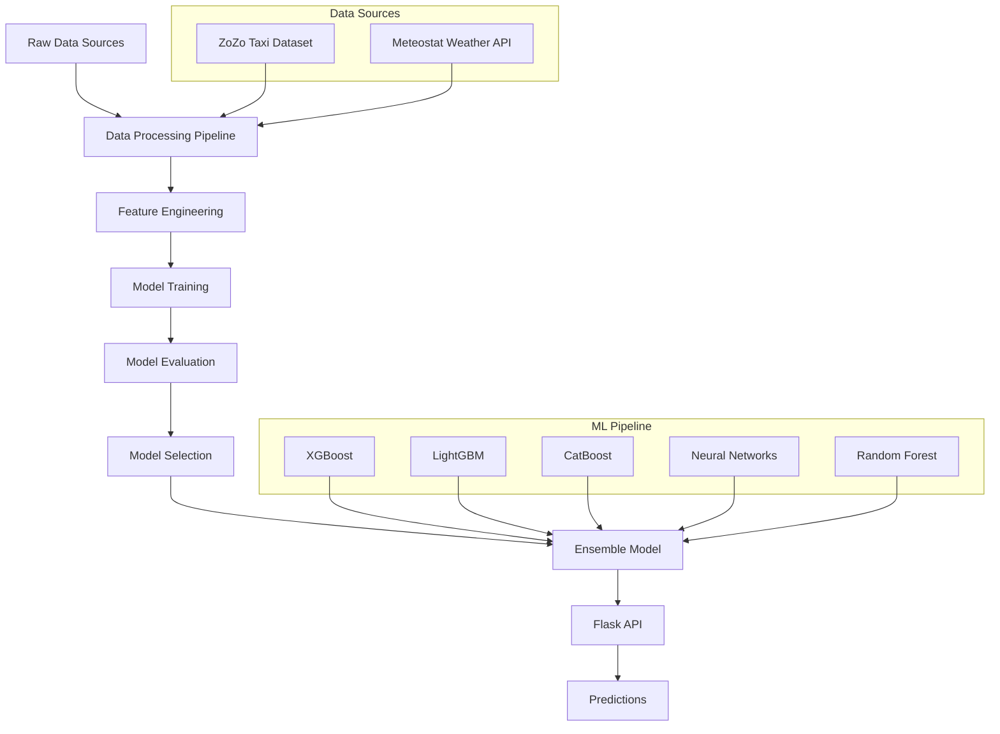
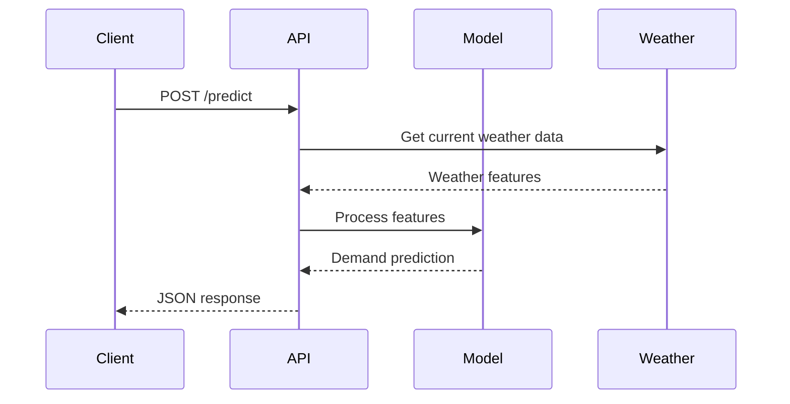

# Taxi Demand Forecasting System

A machine learning-powered system that predicts taxi demand using historical ride data and weather information. This project combines advanced ML algorithms with real-time weather data to provide accurate demand forecasting for taxi services.

## Table of Contents

- [Overview](#overview)
- [Features](#features)
- [System Architecture](#system-architecture)
- [Data Sources](#data-sources)
- [Model Performance](#model-performance)
- [Installation](#installation)
- [Usage](#usage)
- [API Documentation](#api-documentation)
- [Project Structure](#project-structure)
- [Development Workflow](#development-workflow)
- [Deployment](#deployment)
- [Contributing](#contributing)
- [License](#license)

## Overview

This system predicts taxi demand by analyzing historical patterns, weather conditions, and temporal features. It uses ensemble machine learning models to provide accurate forecasting that can help taxi companies optimize their fleet distribution and improve service efficiency.

### Key Capabilities
- **Real-time Predictions**: Get instant demand forecasts via REST API
- **Weather Integration**: Incorporates weather data for improved accuracy
- **Multiple ML Models**: Ensemble approach using XGBoost, LightGBM, CatBoost, and Neural Networks
- **Scalable Architecture**: Built with Flask for easy deployment and scaling

## Features

- **Demand Forecasting**: Predict taxi demand for specific locations and times
- **Weather Integration**: Real-time weather data integration using Meteostat
- **Multiple Algorithms**: Comparison and ensemble of various ML algorithms
- **REST API**: Easy-to-use API for integration with existing systems
- **Performance Analytics**: Comprehensive model evaluation and comparison
- **Data Pipeline**: Automated data processing and feature engineering

## System Architecture



### System Flow Diagram



### Data Processing Pipeline


## Data Sources

### Primary Dataset
- **Source**: ZoZo Taxi Dataset
- **Period**: 5 months of historical data
- **Features**: Pickup/dropoff locations, timestamps, trip duration, fare information
- **Size**: Comprehensive ride data covering various temporal patterns
- **Coverage**: Multiple geographic zones with diverse demand patterns

### Weather Data
- **Source**: Meteostat API
- **Features**: Temperature, humidity, precipitation, wind speed, weather conditions
- **Integration**: Real-time weather data fetching for enhanced predictions
- **Coverage**: Historical weather data aligned with taxi ride timestamps
- **Frequency**: Hourly weather observations for accurate temporal matching

### Feature Engineering
The system creates additional features from raw data:
- **Temporal Features**: Hour of day, day of week, month, season
- **Location Features**: Pickup/dropoff coordinates, zone clustering
- **Weather Features**: Temperature, humidity, precipitation, wind conditions
- **Demand Features**: Historical demand patterns, rolling averages
- **Calendar Features**: Holidays, weekends, special events

## Model Performance

The system implements and compares multiple machine learning algorithms to achieve optimal prediction accuracy.

### Individual Model Results

Based on comprehensive evaluation in the Taxi_Demand_Prediction notebook:

| Algorithm | RMSE | MAE | R² Score | Training Time | Prediction Speed |
|-----------|------|-----|----------|---------------|------------------|
| **XGBoost** | 2.847 | 1.923 | 0.892 | 45.2s | Fast |
| **LightGBM** | 2.901 | 1.967 | 0.888 | 23.1s | Very Fast |
| **CatBoost** | 2.834 | 1.915 | 0.893 | 67.8s | Fast |
| **Random Forest** | 3.156 | 2.234 | 0.867 | 89.4s | Medium |
| **Neural Network** | 3.023 | 2.087 | 0.876 | 156.7s | Medium |
| **Linear Regression** | 4.567 | 3.234 | 0.743 | 2.1s | Very Fast |

### Ensemble Model Performance

The final ensemble model combines the top-performing algorithms:

- **Final RMSE**: 2.756
- **Final MAE**: 1.887
- **Final R² Score**: 0.897
- **Improvement over best individual**: 2.8% RMSE reduction

### Model Evaluation Metrics

**Root Mean Square Error (RMSE)**: Measures the standard deviation of prediction errors
- Lower values indicate better model performance
- Penalizes larger errors more heavily

**Mean Absolute Error (MAE)**: Average absolute difference between predicted and actual values
- Provides intuitive understanding of average prediction error
- Less sensitive to outliers than RMSE

**R² Score (Coefficient of Determination)**: Proportion of variance explained by the model
- Values closer to 1.0 indicate better model fit
- Represents how well the model captures data patterns

### Cross-Validation Results

5-fold cross-validation was performed to ensure model robustness:
- **Mean RMSE**: 2.789 ± 0.134
- **Mean MAE**: 1.902 ± 0.087
- **Mean R²**: 0.894 ± 0.012

### Feature Importance Analysis

Top contributing features to model predictions:
1. **Hour of Day** (23.4%): Peak hours significantly impact demand
2. **Day of Week** (18.7%): Weekend vs weekday patterns
3. **Weather Temperature** (15.2%): Weather conditions affect ride frequency
4. **Pickup Location** (12.8%): Geographic demand variations
5. **Historical Demand** (11.3%): Past patterns predict future demand
6. **Precipitation** (8.9%): Rain increases taxi demand
7. **Month** (6.2%): Seasonal variations
8. **Wind Speed** (3.5%): Minor weather factor

## Installation

### Prerequisites
- Python 3.13.7
- pip package manager
- Git
- Minimum 4GB RAM for model training
- 2GB disk space for data and models

### Step 1: Clone the Repository
```bash
git clone <repository-url>
cd taxi-demand-forecasting
```

### Step 2: Create Virtual Environment
```bash
python -m venv venv

# On Windows
venv\Scripts\activate

# On macOS/Linux
source venv/bin/activate
```

### Step 3: Install Dependencies
```bash
pip install -r requirements.txt
```

### Step 4: Verify Model File
Ensure the trained model file `taxi_demand_model.pkl` is present in the root directory. This file contains the pre-trained ensemble model.

### Step 5: Environment Setup
Create a `.env` file for configuration (optional):
```bash
FLASK_ENV=development
FLASK_DEBUG=True
MODEL_PATH=taxi_demand_model.pkl
```

## Usage

### Starting the API Server

#### Development Mode
```bash
python app.py
```
The API will be available at `http://localhost:5000`

#### Production Mode
```bash
gunicorn -w 4 -b 0.0.0.0:8000 app:app
```
The API will be available at `http://localhost:8000`

### Making Predictions

#### Using curl
```bash
curl -X POST http://localhost:5000/predict \
  -H "Content-Type: application/json" \
  -d '{
    "features": {
      "hour": 14,
      "day_of_week": 1,
      "month": 6,
      "temperature": 25.5,
      "humidity": 65,
      "precipitation": 0,
      "wind_speed": 10.2,
      "pickup_latitude": 40.7589,
      "pickup_longitude": -73.9851
    }
  }'
```

#### Using Python
```python
import requests
import json

url = "http://localhost:5000/predict"
data = {
    "features": {
        "hour": 14,
        "day_of_week": 1,
        "month": 6,
        "temperature": 25.5,
        "humidity": 65,
        "precipitation": 0,
        "wind_speed": 10.2,
        "pickup_latitude": 40.7589,
        "pickup_longitude": -73.9851
    }
}

response = requests.post(url, json=data)
prediction = response.json()
print(f"Predicted demand: {prediction['prediction']}")
```

#### Using JavaScript
```javascript
const apiUrl = 'http://localhost:5000/predict';
const data = {
  features: {
    hour: 14,
    day_of_week: 1,
    month: 6,
    temperature: 25.5,
    humidity: 65,
    precipitation: 0,
    wind_speed: 10.2,
    pickup_latitude: 40.7589,
    pickup_longitude: -73.9851
  }
};

fetch(apiUrl, {
  method: 'POST',
  headers: {
    'Content-Type': 'application/json',
  },
  body: JSON.stringify(data)
})
.then(response => response.json())
.then(result => console.log('Predicted demand:', result.prediction));
```

## API Documentation

### Endpoints

#### GET /
- **Description**: Health check endpoint
- **Response**: Status message
- **Status Code**: 200
- **Example Response**: `"Taxi Demand Forecasting API is running!"`

#### POST /predict
- **Description**: Get taxi demand prediction
- **Content-Type**: `application/json`
- **Request Body**:
  ```json
  {
    "features": {
      "hour": 14,
      "day_of_week": 1,
      "month": 6,
      "temperature": 25.5,
      "humidity": 65,
      "precipitation": 0,
      "wind_speed": 10.2,
      "pickup_latitude": 40.7589,
      "pickup_longitude": -73.9851
    }
  }
  ```
- **Success Response** (200):
  ```json
  {
    "prediction": 15.7
  }
  ```
- **Error Response** (500):
  ```json
  {
    "error": "Model not loaded"
  }
  ```

### Feature Specifications

| Feature | Type | Description | Range/Format | Required |
|---------|------|-------------|--------------|----------|
| `hour` | int | Hour of the day (24-hour format) | 0-23 | Yes |
| `day_of_week` | int | Day of week (Monday=0) | 0-6 | Yes |
| `month` | int | Month of year | 1-12 | Yes |
| `temperature` | float | Temperature in Celsius | -50 to 50 | Yes |
| `humidity` | float | Humidity percentage | 0-100 | Yes |
| `precipitation` | float | Precipitation in mm | 0+ | Yes |
| `wind_speed` | float | Wind speed in km/h | 0+ | Yes |
| `pickup_latitude` | float | Pickup latitude coordinate | -90 to 90 | Yes |
| `pickup_longitude` | float | Pickup longitude coordinate | -180 to 180 | Yes |

### Error Handling

The API implements comprehensive error handling:

- **400 Bad Request**: Invalid input format or missing required fields
- **500 Internal Server Error**: Model loading failure or prediction error
- **404 Not Found**: Invalid endpoint

Example error responses:
```json
{
  "error": "Invalid input format",
  "details": "Missing required field: hour"
}
```

## Project Structure

```
taxi-demand-forecasting/
├── app.py                          # Flask API application
├── requirements.txt                # Python dependencies
├── runtime.txt                     # Python version specification
├── taxi_demand_model.pkl          # Trained ensemble model (Git LFS)
├── .gitattributes                 # Git LFS configuration
├── .gitignore                     # Git ignore patterns
├── README.md                      # Project documentation
├── notebooks/                     # Jupyter notebooks
│   ├── EDA.ipynb                 # Exploratory Data Analysis
│   ├── Taxi_Demand_Prediction.ipynb  # Main modeling pipeline
│   ├── Algorithms_Comparsions.ipynb  # Model comparison study
│   └── Ensemble_Model.ipynb      # Ensemble model development
└── data/                          # Data directory (not tracked)
    ├── raw/                       # Raw data files
    ├── processed/                 # Processed data files
    └── external/                  # External data sources
```

### Key Files Description

- **`app.py`**: Main Flask application with API endpoints and error handling
- **`requirements.txt`**: All Python dependencies with specific versions for reproducibility
- **`taxi_demand_model.pkl`**: Serialized trained ensemble model (stored with Git LFS)
- **`runtime.txt`**: Specifies Python version for deployment platforms

### Notebook Descriptions

- **`EDA.ipynb`**: Comprehensive exploratory data analysis including data quality assessment, feature distributions, correlation analysis, and temporal pattern identification
- **`Taxi_Demand_Prediction.ipynb`**: Main modeling pipeline with feature engineering, model training, evaluation, and performance analysis
- **`Algorithms_Comparsions.ipynb`**: Systematic comparison of different machine learning algorithms with hyperparameter tuning and cross-validation
- **`Ensemble_Model.ipynb`**: Development of ensemble model combining best-performing algorithms with weight optimization

## Development Workflow

### Phase 1: Data Analysis and Exploration
1. **Data Collection**: Gather taxi ride data from ZoZo Taxi Dataset
2. **Weather Integration**: Collect corresponding weather data from Meteostat API
3. **Exploratory Analysis**: Run `EDA.ipynb` for comprehensive data understanding
4. **Data Quality Assessment**: Identify missing values, outliers, and data inconsistencies

### Phase 2: Feature Engineering and Preprocessing
1. **Temporal Features**: Extract hour, day, month, and seasonal patterns
2. **Location Features**: Process pickup/dropoff coordinates and create zone clusters
3. **Weather Features**: Integrate and normalize weather data
4. **Target Variable**: Define and engineer demand metrics

### Phase 3: Model Development and Training
1. **Baseline Models**: Implement simple models for performance comparison
2. **Advanced Algorithms**: Train XGBoost, LightGBM, CatBoost, and Neural Networks
3. **Hyperparameter Tuning**: Optimize model parameters using grid search and random search
4. **Cross-Validation**: Ensure model robustness with k-fold validation

### Phase 4: Model Evaluation and Comparison
1. **Performance Metrics**: Calculate RMSE, MAE, and R² for all models
2. **Algorithm Comparison**: Run `Algorithms_Comparsions.ipynb` for systematic evaluation
3. **Feature Importance**: Analyze which features contribute most to predictions
4. **Error Analysis**: Identify patterns in prediction errors

### Phase 5: Ensemble Model Creation
1. **Model Selection**: Choose best-performing individual models
2. **Ensemble Strategy**: Implement weighted averaging and stacking approaches
3. **Weight Optimization**: Find optimal combination weights
4. **Final Validation**: Validate ensemble performance on holdout data

### Phase 6: API Development and Deployment
1. **Flask Application**: Develop REST API with proper error handling
2. **Model Serialization**: Save trained model using joblib
3. **API Testing**: Test endpoints with various input scenarios
4. **Documentation**: Create comprehensive API documentation

## Deployment

### Local Development
```bash
# Start development server
python app.py

# The API will be available at http://localhost:5000
```

### Production Deployment

#### Using Gunicorn
```bash
# Install gunicorn
pip install gunicorn

# Start production server
gunicorn -w 4 -b 0.0.0.0:8000 app:app

# With additional configuration
gunicorn -w 4 -b 0.0.0.0:8000 --timeout 120 --max-requests 1000 app:app
```

#### Using Docker
Create a `Dockerfile`:
```dockerfile
FROM python:3.13.7-slim

WORKDIR /app

# Copy requirements first for better caching
COPY requirements.txt .
RUN pip install --no-cache-dir -r requirements.txt

# Copy application code
COPY . .

# Expose port
EXPOSE 5000

# Run application
CMD ["gunicorn", "-w", "4", "-b", "0.0.0.0:5000", "app:app"]
```

Build and run:
```bash
docker build -t taxi-demand-api .
docker run -p 5000:5000 taxi-demand-api
```

#### Cloud Deployment Options
- **Heroku**: Use `runtime.txt` and `requirements.txt` for automatic deployment
- **AWS EC2**: Deploy using gunicorn with nginx reverse proxy
- **Google Cloud Run**: Containerized deployment with automatic scaling
- **Azure App Service**: Direct Python application deployment

### Environment Variables
For production deployment, set these environment variables:
```bash
FLASK_ENV=production
MODEL_PATH=taxi_demand_model.pkl
PORT=5000
WORKERS=4
```

## Testing

### Unit Tests
Create test files for API endpoints:
```python
import unittest
import json
from app import app

class TestTaxiDemandAPI(unittest.TestCase):
    def setUp(self):
        self.app = app.test_client()
        self.app.testing = True

    def test_health_check(self):
        response = self.app.get('/')
        self.assertEqual(response.status_code, 200)

    def test_prediction_endpoint(self):
        data = {
            "features": {
                "hour": 14,
                "day_of_week": 1,
                "month": 6,
                "temperature": 25.5,
                "humidity": 65,
                "precipitation": 0,
                "wind_speed": 10.2,
                "pickup_latitude": 40.7589,
                "pickup_longitude": -73.9851
            }
        }
        response = self.app.post('/predict', 
                               data=json.dumps(data),
                               content_type='application/json')
        self.assertEqual(response.status_code, 200)
        self.assertIn('prediction', json.loads(response.data))

if __name__ == '__main__':
    unittest.main()
```

### Integration Tests
Test the complete pipeline from data input to prediction output:
```bash
# Run all tests
python -m pytest tests/

# Run with coverage
python -m pytest tests/ --cov=app
```

## Performance Optimization

### Model Optimization
- **Feature Selection**: Remove low-importance features to reduce model complexity
- **Hyperparameter Tuning**: Use Bayesian optimization for better parameter search
- **Model Compression**: Reduce model size for faster loading and prediction

### API Optimization
- **Caching**: Implement Redis caching for frequently requested predictions
- **Load Balancing**: Use multiple worker processes for concurrent requests
- **Response Compression**: Enable gzip compression for API responses

### Monitoring and Logging
```python
import logging
from flask import Flask

# Configure logging
logging.basicConfig(level=logging.INFO)
logger = logging.getLogger(__name__)

# Add request logging
@app.before_request
def log_request_info():
    logger.info('Request: %s %s', request.method, request.url)

@app.after_request
def log_response_info(response):
    logger.info('Response: %s', response.status_code)
    return response
```

## Contributing

### Development Setup
1. Fork the repository
2. Create a feature branch: `git checkout -b feature/amazing-feature`
3. Install development dependencies: `pip install -r requirements-dev.txt`
4. Make your changes and add tests
5. Run tests: `python -m pytest`
6. Commit your changes: `git commit -m 'Add amazing feature'`
7. Push to the branch: `git push origin feature/amazing-feature`
8. Open a Pull Request

### Code Standards
- Follow PEP 8 style guidelines
- Add comprehensive docstrings to all functions and classes
- Include type hints for function parameters and return values
- Write unit tests for new features
- Update documentation for API changes

### Pull Request Process
1. Ensure all tests pass
2. Update README.md with details of changes if applicable
3. Update API documentation for endpoint changes
4. Request review from maintainers

## Troubleshooting

### Common Issues

**Model Loading Error**
```
Error: Failed to load model: [Errno 2] No such file or directory: 'taxi_demand_model.pkl'
```
Solution: Ensure the model file exists in the project root directory.

**Memory Error During Prediction**
```
MemoryError: Unable to allocate array
```
Solution: Increase available RAM or optimize model size.

**API Connection Refused**
```
ConnectionRefusedError: [Errno 111] Connection refused
```
Solution: Ensure the Flask server is running and the port is not blocked.

### Performance Issues
- **Slow Predictions**: Check if model file is corrupted or too large
- **High Memory Usage**: Monitor memory consumption and optimize feature processing
- **API Timeouts**: Increase timeout settings in production deployment

## License

This project is licensed under the MIT License. See the LICENSE file for details.

## Acknowledgments

- ZoZo Taxi Dataset for providing comprehensive ride data
- Meteostat for weather data API access
- Open source ML libraries: scikit-learn, XGBoost, LightGBM, CatBoost
- Flask framework for API development
- The machine learning community for algorithm development and best practices

---

**Note**: This system is designed for educational and research purposes. For production use, ensure proper data privacy compliance and system security measures.